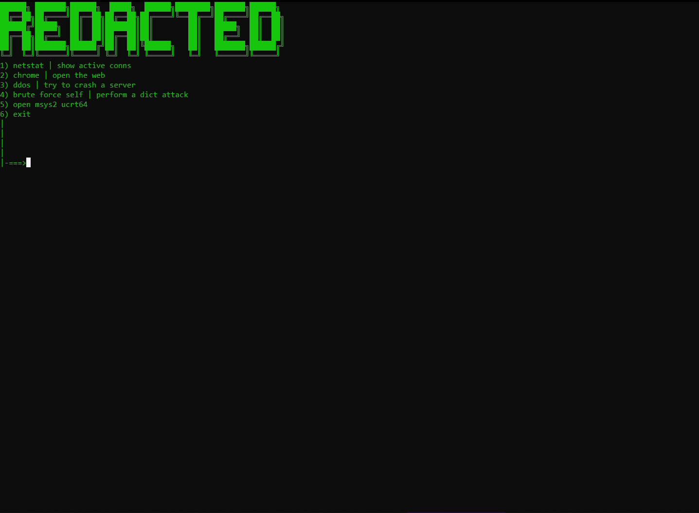

<h1>a multittool made by a kid!</h1>

<h2>🗒: this is only for windows so far</h2>

 

<h1 style="bg-color: green;">install:</h1>
 
<h3>windows:</h3>
<code>git clone https://github.com/danieeel984/little-multitool-</code>

 
 
<h2>im still making this so give me some ideas if you want more tools and stuff! :)</h2>
                                                       

